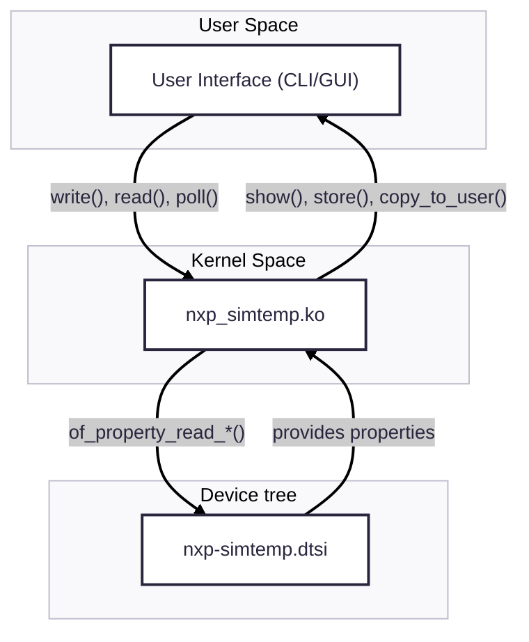
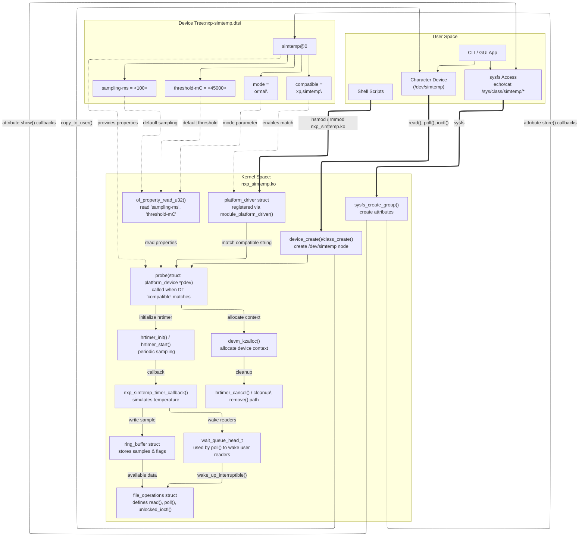

# System Architecture 
## Diagram System Architecture Overview

Following diagram shows te main components of the **“Virtual Sensor + Alert Path”**


## Detailed Architecture Design


## System Flow Overview
### 1.Initialization Phase
1. The kernel parses the **Device Tree (DT)** when load nxp_simtemp.ko module (`insmod`), .
2. When a DT node with `compatible = "nxp,simtemp"` is found, the kernel creates a corresponding `platform_device` instance.
3. **nxp_simtemp platform driver** registers itself using `platform_driver_register()`.
4. Kernel matches the DT node to the driver’s `of_match_table`, triggering the driver’s `probe()` callback.
5. Inside `probe()`, the driver:
   - Reads configuration parameters from the DT with `of_property_read_*()` API.
   - Allocates memory for internal structures (buffer, state).
   - Initializes the `hrtimer` or workqueue responsible for periodic temperature sample generation.
   - Creates **sysfs entries** for runtime configuration and exposes a **character device** for user-space access.

## 2. Runtime Operation
1. The `hrtimer` or workqueue triggers periodically, every *N* milliseconds, as defined by the `sampling-ms` property.
2. On each trigger:
   - A new simulated temperature value is processed.
   - The sample is stored into a **ring buffer**.
   - When threshold exceeded, a **wait queue** wakes up user-space readers waiting via `poll()` or `read()`.
3. The driver continuously updates internal metrics (e.g. timestamp) as part of the simulation logic.

## 3. User-Space Interaction
### User interface (CLI/GUI)
1. Character Device Interface (`/dev/simtemp`)
    - **User interface* use `open()`, `read()`, `poll()`, or `ioctl()` system calls.
    - `read()` copies the latest temperature samples to user space via `copy_to_user()`.
    - `poll()` allows applications to wait for new data events asynchronously.

2. Sysfs Interface (`/sys/class/simtemp/`)
    - User can modify configuration parameters dynamically through **User interface** e.g:
      ```bash
      echo 500 > /sys/class/simtemp/sampling_ms
      echo 42000 > /sys/class/simtemp/threshold_mC
      ```


